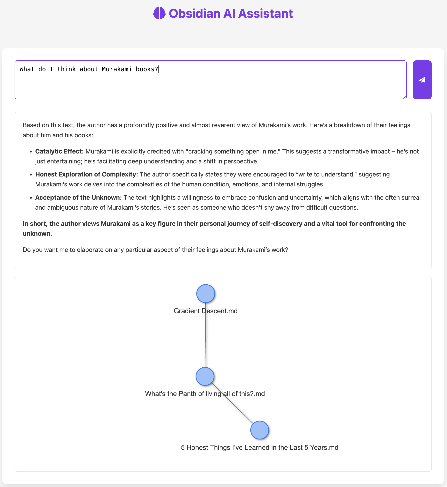

# Obsidian AI Assistant

An AI-powered assistant for your Obsidian vault that helps you find connections between your notes and answer questions about your knowledge base.

## Features

- Ask questions about your Obsidian vault content
- Get AI-generated answers based on your notes
- Visualize connections between notes with an interactive graph
- See which notes were referenced in the AI's response

## Screenshots

### Setup Screen


### Chat Interface


## Installation

If you prefer to run the application manually:

1. Clone this repository
2. Install the required dependencies:
   ```
   pip install -r requirements.txt
   ```
3. Run the application:
   ```
   python app.py
   ```

## Usage

1. Launch the Obsidian AI Assistant
2. Select your Obsidian vault from the dropdown menu
3. Enter your question in the text area
4. Click "Ask Question" to get an AI-generated response
5. View the response, referenced files, and note connections graph

## Requirements

- Python 3.7 or higher
- Obsidian vault with markdown files
- Internet connection for AI model access

## License

MIT 
